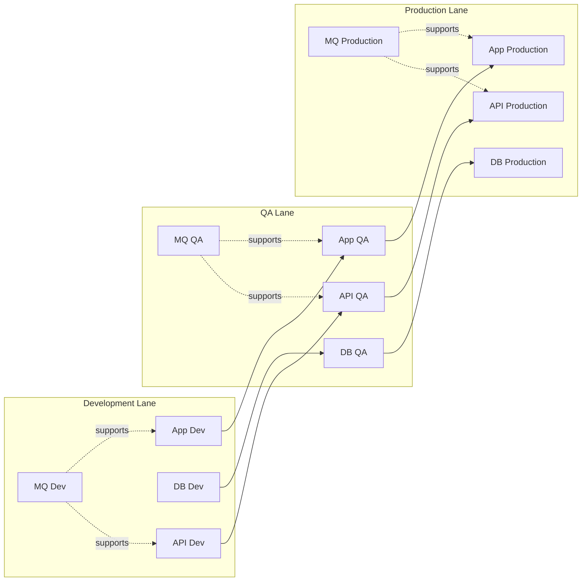

# Milestone 3 Promotion Design

## Promotion Workflow

App:
Development App → QA App → Production App

DB:
Development DB → QA DB → Production DB

API:
Development API → QA API → Production API

MQ:
A RabbitMQ VM is required in Development, QA, and Production.

## Promotion Method

SSH will be used to move approved files between environments.

## Guardrails

- Development can promote to QA.
- QA can promote to Production.
- Development cannot promote directly to Production.
- Passwords and secrets are not stored in the inventory file.

## Promotion Workflow

